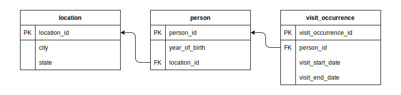
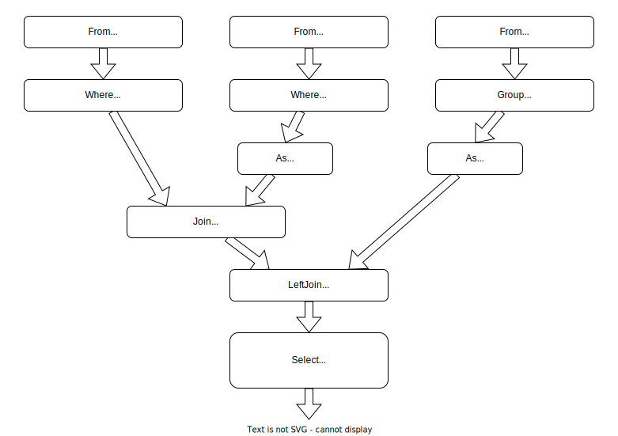

# FunSQL.jl

*FunSQL is a Julia library for compositional construction of SQL queries.*

[![Stable Documentation][docs-rel-img]][docs-rel-url]
[![Development Documentation][docs-dev-img]][docs-dev-url]
[![Zulip Chat][chat-img]][chat-url]
[![Open Issues][issues-img]][issues-url]
[![Build Status][ci-img]][ci-url]
[![Code Coverage Status][codecov-img]][codecov-url]
[![MIT License][license-img]][license-url]
[![DOI][doi-img]][doi-url]


## Overview

Julia programmers sometimes need to interrogate data with the Structured Query
Language (SQL).  But SQL is notoriously hard to write in a modular fashion.

FunSQL exposes full expressive power of SQL with a compositional semantics.
FunSQL allows you to build queries incrementally from small independent
fragments.  This approach is particularly useful for building applications that
programmatically construct SQL queries.

If you want to learn more about FunSQL, read about [Two Kinds of SQL Query
Builders][tkosqb-url], watch the [JuliaCon 2021 presentation][juliacon2021-url]
([slides][juliacon2021-slides]), explore the [Examples][examples-url], or go
straight to the [Usage Guide][guide-url].

[![FunSQL | JuliaCon 2021][juliacon2021-img]][juliacon2021-url]


## Example

*When was the last time each person born between 1930 and 1940 and living in
Illinois was seen by a healthcare provider?*

<details><summary>Database Schema</summary>



</details>

<details><summary>Pipeline Diagram</summary>



</details>

<details open><summary>Julia Code</summary>

```julia
@funsql begin
    from(person)
    filter(1930 <= year_of_birth <= 1940)
    join(
        from(location).filter(state == "IL").as(location),
        on = location_id == location.location_id)
    left_join(
        from(visit_occurrence).group(person_id).as(visit_group),
        on = person_id == visit_group.person_id)
    select(
        person_id,
        latest_visit_date => visit_group.max(visit_start_date))
end
```

</details>

<details><summary>Generated SQL</summary>

```sql
SELECT
  "person_2"."person_id",
  "visit_group_1"."max" AS "latest_visit_date"
FROM (
  SELECT
    "person_1"."person_id",
    "person_1"."location_id"
  FROM "person" AS "person_1"
  WHERE
    (1930 <= "person_1"."year_of_birth") AND
    ("person_1"."year_of_birth" <= 1940)
) AS "person_2"
JOIN (
  SELECT "location_1"."location_id"
  FROM "location" AS "location_1"
  WHERE ("location_1"."state" = 'IL')
) AS "location_2" ON ("person_2"."location_id" = "location_2"."location_id")
LEFT JOIN (
  SELECT
    max("visit_occurrence_1"."visit_start_date") AS "max",
    "visit_occurrence_1"."person_id"
  FROM "visit_occurrence" AS "visit_occurrence_1"
  GROUP BY "visit_occurrence_1"."person_id"
) AS "visit_group_1" ON ("person_2"."person_id" = "visit_group_1"."person_id")
```

</details>


[docs-rel-img]: https://img.shields.io/badge/docs-stable-green.svg
[docs-rel-url]: https://mechanicalrabbit.github.io/FunSQL.jl/stable/
[docs-dev-img]: https://img.shields.io/badge/docs-dev-blue.svg
[docs-dev-url]: https://mechanicalrabbit.github.io/FunSQL.jl/dev/
[chat-img]: https://img.shields.io/badge/chat-julia--zulip-blue
[chat-url]: https://julialang.zulipchat.com/#narrow/stream/284102-funsql.2Ejl
[doi-img]: https://zenodo.org/badge/352933573.svg
[doi-url]: https://zenodo.org/badge/latestdoi/352933573
[issues-img]: https://img.shields.io/github/issues/MechanicalRabbit/FunSQL.jl.svg
[issues-url]: https://github.com/MechanicalRabbit/FunSQL.jl/issues
[ci-img]: https://github.com/MechanicalRabbit/FunSQL.jl/workflows/CI/badge.svg
[ci-url]: https://github.com/MechanicalRabbit/FunSQL.jl/actions?query=workflow%3ACI+branch%3Amaster
[codecov-img]: https://codecov.io/gh/MechanicalRabbit/FunSQL.jl/branch/master/graph/badge.svg
[codecov-url]: https://codecov.io/gh/MechanicalRabbit/FunSQL.jl
[license-img]: https://img.shields.io/badge/license-MIT-blue.svg
[license-url]: https://raw.githubusercontent.com/MechanicalRabbit/FunSQL.jl/master/LICENSE.md
[juliacon2021-img]: https://img.youtube.com/vi/rGWwmuvRUYk/maxresdefault.jpg
[juliacon2021-url]: https://www.youtube.com/watch?v=rGWwmuvRUYk
[juliacon2021-slides]: https://github.com/MechanicalRabbit/FunSQL.jl/files/7465997/FunSQL-JuliaCon2021.pdf
[guide-url]: https://mechanicalrabbit.github.io/FunSQL.jl/stable/guide/
[examples-url]: https://mechanicalrabbit.github.io/FunSQL.jl/stable/examples/
[tkosqb-url]: https://mechanicalrabbit.github.io/FunSQL.jl/stable/two-kinds-of-sql-query-builders/
