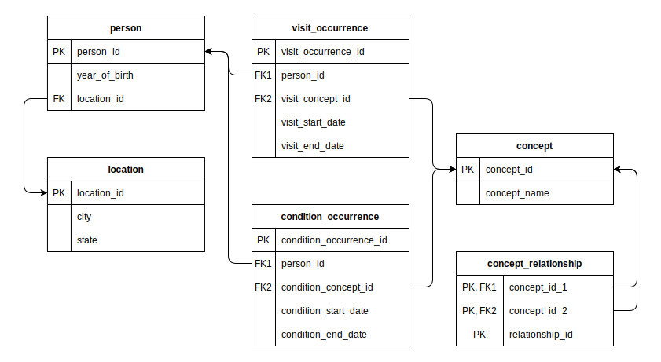
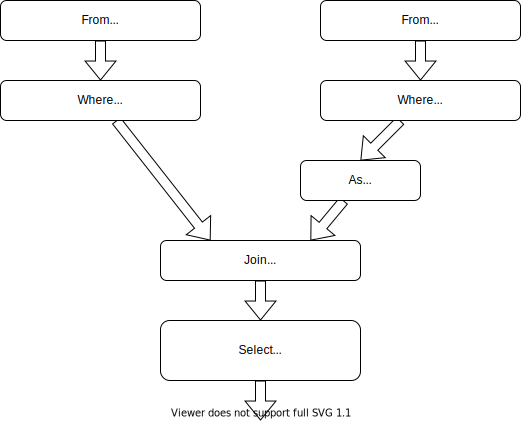

# Usage Guide

```@meta
CurrentModule = FunSQL
```

This guide will teach you how to assemble SQL queries using FunSQL.


## Test Database

To demonstrate database queries, we need a test database.  The database we use
here is a tiny 10 person sample of simulated patient data extracted from a much
larger [CMS DE-SynPuf
dataset](https://www.cms.gov/Research-Statistics-Data-and-Systems/Downloadable-Public-Use-Files/SynPUFs/DE_Syn_PUF).
For a database engine, we picked [SQLite](https://www.sqlite.org/).  Using
SQLite in a guide is convenient because it does not require a database server
to run and allows us to distribute the whole database as a single file.  FunSQL
supports SQLite and many other database engines.  The techniques discussed here
are not specific to SQLite and once you learn them, you will be able to apply
them to any SQL database.

If you wish to follow along with the guide and run the examples, download
the database file:

```julia
const URL = "https://github.com/MechanicalRabbit/ohdsi-synpuf-demo/releases/download/20210412/synpuf-10p.sqlite"
const DB = download(URL)
```

All examples in this guide are tested on each update using the
[NarrativeTest](https://github.com/MechanicalRabbit/NarrativeTest.jl) package.
To avoid downloading the database file all the time, we registered the download
URL as an [artifact](../Artifacts.toml) and use
[`Pkg.Artifacts`](http://pkgdocs.julialang.org/v1/artifacts/) API to fetch it:

    using Pkg.Artifacts, LazyArtifacts

    const DB = joinpath(artifact"synpuf-10p", "synpuf-10p.sqlite")
    #-> ⋮


## Database Connection

To interact with a SQLite database from Julia code, we need to install the
[SQLite](https://github.com/JuliaDatabases/SQLite.jl) package:

```julia
using Pkg

Pkg.add("SQLite")
```

Once the package is installed, we can use it to connect to the database:

    using SQLite

    const conn = SQLite.DB(DB)

Later we will use the `conn` object to execute database queries.


## Database Schema

The data in the test database is stored in the format of the [OMOP Common Data
Model](https://ohdsi.github.io/TheBookOfOhdsi/CommonDataModel.html), an open
source database schema for observational healthcare data.  In this guide, we
will only use a small fragment of the Common Data Model.



Before we can start assembling queries with FunSQL, we need to make FunSQL
aware of the database schema.  For each table in the database, we need to
create a corresponding [`SQLTable`](@ref) object, which encapsulates the name
of the table together with the names of the columns.

    using FunSQL: SQLTable

The patient data, including basic demographic information, is stored in the
table `person`:

    const person =
        SQLTable(:person,
                 columns = [:person_id, :year_of_birth, :location_id])

Patient addresses are stored in a separate table `location`, linked to `person`
by the key column `location_id`:

    const location =
        SQLTable(:location,
                 columns = [:location_id, :city, :state])

The bulk of patient data consists of clinical events: visits to healthcare
providers, recorded observations, diagnosed conditions, prescribed medications,
etc.  In this guide we only use two types of events, visits and conditions:

    const visit_occurrence =
        SQLTable(:visit_occurrence,
                 columns = [:visit_occurrence_id, :person_id,
                            :visit_concept_id,
                            :visit_start_date, :visit_end_date])

    const condition_occurrence =
        SQLTable(:condition_occurrence,
                 columns = [:condition_occurrence_id, :person_id,
                            :condition_concept_id,
                            :condition_start_date, :condition_end_date])

The specific type of the event (e.g., *Inpatient* visit or *Essential
hypertension* condition) is indicated using a *concept id* column, which refers
to the `concept` table:

    const concept =
        SQLTable(:concept,
                 columns = [:concept_id, :concept_name])

Different concepts may be related to each other.  For instance, *Essential
hypertension* **is a** *Hypertensive disorder*, which itself **is a** *Disorder
of cardiovascular system*.  Concept relationships are recorded in the
corresponding table:

    const concept_relationship =
        SQLTable(:concept_relationship,
                 columns = [:concept_id_1, :concept_id_2, :relationship_id])


## Why FunSQL?

Let us start with clarifying the purpose of FunSQL.  Consider a problem:

*Find all patients born between 1930 and 1940 and living in Illinois, and for
each patient show their current age (by the end of 2020).*

The answer can be obtained with the following SQL query:

```sql
SELECT p.person_id, 2020 - p.year_of_birth AS age
FROM person p
JOIN location l ON (p.location_id = l.location_id)
WHERE (p.year_of_birth BETWEEN 1930 AND 1940) AND (l.state = 'IL')
```

The simplest way to incorporate this query into Julia code is to embed it as a
string literal:

    sql = """
    SELECT p.person_id, 2020 - p.year_of_birth AS age
    FROM person p
    JOIN location l ON (p.location_id = l.location_id)
    WHERE (p.year_of_birth BETWEEN 1930 AND 1940) AND (l.state = 'IL')
    """

Using the appropriate [database engine
API](https://juliadatabases.org/SQLite.jl/stable/#DBInterface.execute) and the
connection object created [earlier](@ref Test-Database), we can execute this
query and get back the answer:

    res = DBInterface.execute(conn, sql)
    #-> SQLite.Query( … )

As an aside, it is convenient to use the
[DataFrame](https://github.com/JuliaData/DataFrames.jl) interface to show the
output of a query in tabular form:

    using DataFrames

    DataFrame(res)
    #=>
    1×2 DataFrame
     Row │ person_id  age
         │ Int64      Int64
    ─────┼──────────────────
       1 │     72120     83
    =#

FunSQL introduces an extra step to this workflow.  Instead of embedding the SQL
query directly into Julia code, we construct a *query object*:

    using FunSQL: As, From, Fun, Get, Join, Select, Where

    q = From(person) |>
        Where(Fun.between(Get.year_of_birth, 1930, 1940)) |>
        Join(From(location) |> Where(Get.state .== "IL") |> As(:location),
             on = Get.location_id .== Get.location.location_id) |>
        Select(Get.person_id, :age => 2020 .- Get.year_of_birth)

The value of `q` is a composite object of type [`SQLNode`](@ref).  "Composite"
means that `q` is assembled from components (also of type `SQLNode`), which
themselves are either atomic or assembled from smaller components.  Different
kinds of components are created by `SQLNode` constructors such as `From`,
`Where`, `Fun`, `Get`, etc.

The actual SQL query is generated by *rendering* the query object:

    using FunSQL: render

    sql = render(q, dialect = :sqlite)

    print(sql)
    #=>
    SELECT "person_2"."person_id", (2020 - "person_2"."year_of_birth") AS "age"
    FROM (
      SELECT "person_1"."location_id", "person_1"."person_id", "person_1"."year_of_birth"
      FROM "person" AS "person_1"
      WHERE ("person_1"."year_of_birth" BETWEEN 1930 AND 1940)
    ) AS "person_2"
    JOIN (
      SELECT "location_1"."location_id"
      FROM "location" AS "location_1"
      WHERE ("location_1"."state" = 'IL')
    ) AS "location_2" ON ("person_2"."location_id" = "location_2"."location_id")
    =#

Notice that the [`render`](@ref) function takes a parameter called `dialect`.
Although the SQL language is standardized, different implementations of SQL
tend to deviate from the standard far enough to make them mutually
incompatible.  For this reason, FunSQL lets us select the target SQL dialect.

At this point, the job of FunSQL is done and, just as before, we can execute
the query and display the result:

    res = DBInterface.execute(conn, sql)

    DataFrame(res)
    #=>
    1×2 DataFrame
     Row │ person_id  age
         │ Int64      Int64
    ─────┼──────────────────
       1 │     72120     83
    =#

Why, instead of embedding a complete SQL query, we prefer to generate it
through a query object?  To justify this extra step, consider that in a real
Julia program, any query is likely going to be parameterized:

*Find all patients born between `$start_year` and `$end_year` and living in
`$states`, and for each patient show the `$output_columns`.*

If this is the case, the SQL query cannot be prepared in advance and must be
assembled on the fly.  While it is possible to assemble a SQL query from string
fragments, it is tedious, error-prone and definitely not fun.  FunSQL provides
a more robust and effective approach: build the query as a composite data
structure.

Here is how a parameterized query may be constructed with FunSQL:

    function FindPatients(; start_year = nothing,
                            end_year = nothing,
                            states = String[])
        q = From(person) |>
            Where(BirthRange(start_year, end_year))
        if !isempty(states)
            q = q |>
                Join(:location => From(location) |>
                                  Where(Fun.in(Get.state, states...)),
                     on = Get.location_id .== Get.location.location_id)
        end
        q
    end

    function BirthRange(start_year, end_year)
        p = true
        if start_year !== nothing
            p = Fun.and(p, Get.year_of_birth .>= start_year)
        end
        if end_year !== nothing
            p = Fun.and(p, Get.year_of_birth .<= end_year)
        end
        p
    end

The function `FindPatients` effectively becomes a new `SQLNode` constructor,
which can be used directly or as a component of a larger query.

*Show all patients.*

    q = FindPatients()

    print(render(q, dialect = :sqlite))
    #=>
    SELECT "person_1"."person_id", "person_1"."year_of_birth", "person_1"."location_id"
    FROM "person" AS "person_1"
    =#

*Show all patients born in or after 1930.*

    q = FindPatients(start_year = 1930) |>
        Select(Get.person_id)

    print(render(q, dialect = :sqlite))
    #=>
    SELECT "person_1"."person_id"
    FROM "person" AS "person_1"
    WHERE ("person_1"."year_of_birth" >= 1930)
    =#

*Find all patients born between 1930 and 1940 and living in Illinois, and for
each patient show their current age.*

    q = FindPatients(start_year = 1930, end_year = 1940, states = ["IL"]) |>
        Select(Get.person_id, :age => 2020 .- Get.year_of_birth)

    print(render(q, dialect = :sqlite))
    #=>
    SELECT "person_2"."person_id", (2020 - "person_2"."year_of_birth") AS "age"
    FROM (
      SELECT "person_1"."location_id", "person_1"."person_id", "person_1"."year_of_birth"
      FROM "person" AS "person_1"
      WHERE (("person_1"."year_of_birth" >= 1930) AND ("person_1"."year_of_birth" <= 1940))
    ) AS "person_2"
    JOIN (
      SELECT "location_1"."location_id"
      FROM "location" AS "location_1"
      WHERE ("location_1"."state" IN ('IL'))
    ) AS "location_2" ON ("person_2"."location_id" = "location_2"."location_id")
    =#


## Tabular Operations

Recall the query from the [previous section](@ref Why-FunSQL?):

*Find all patients born between 1930 and 1940 and living in Illinois, and for
each patient show their current age.*

    From(person) |>
    Where(Fun.between(Get.year_of_birth, 1930, 1940)) |>
    Join(From(location) |> Where(Get.state .== "IL") |> As(:location),
         on = Get.location_id .== Get.location.location_id) |>
    Select(Get.person_id, :age => 2020 .- Get.year_of_birth)

At the outer level, this query is constructed from tabular operations `From`,
`Where`, `Join`, and `Select` arranged in a pipeline by the pipe (`|>`)
operator.  In SQL, a *tabular operation* takes a certain number of input
datasets and produces an output dataset.  It is helpful to visualize a tabular
operation as a node with a certain number of input arrows and one output arrow.


Then the whole query can be visualized as a pipeline diagram.  Each arrow in
this diagram represents a dataset, and each node represents an elementary data
processing operation.



The following tabular operations are available in FunSQL.

| Constructor           | Function                                          |
| :-------------------- | :------------------------------------------------ |
| [`Append`](@ref)      | concatenate datasets                              |
| [`As`](@ref)          | wrap all columns in a nested record               |
| [`Bind`](@ref)        | correlate a subquery in a *join* expression       |
| [`Define`](@ref)      | add an output column                              |
| [`From`](@ref)        | produce the content of a database table           |
| [`Group`](@ref)       | partition the dataset into disjoint groups        |
| [`Join`](@ref)        | correlate two datasets                            |
| [`Limit`](@ref)       | truncate the dataset                              |
| [`Order`](@ref)       | sort the dataset                                  |
| [`Partition`](@ref)   | add a window to the dataset                       |
| [`Select`](@ref)      | specify output columns                            |
| [`Where`](@ref)       | filter the dataset by the given condition         |

Next, we will take a closer look at three of them: `From`, `Select`, and
`Join`.


## `From` and `Select`

The `From` node outputs the content of a database table.  The constructor
takes one argument, a `SQLTable` object (see the section [Database
Schema](@ref)).  In a query, a bare `SQLTable` object is automatically
converted to a `From` node, so one could write more compactly:

*For each patient, show their current age.*

    person |>
    Select(Get.person_id, :age => 2020 .- Get.year_of_birth)

It is possible for a query not to have a `From` node:

*Show the current date and time.*

    q = Select(Fun.current_timestamp())

    sql = render(q)

    print(sql)
    #-> SELECT CURRENT_TIMESTAMP AS "current_timestamp"

In this query, the `Select` node is not connected to any source of data.  In
such a case, it is supplied with a *unit dataset* containing one row and no
columns.  Hence this query will generate one row of output.

In general, the `Select` node is used to specify the output columns.  The name
of the column is either derived from the expression or set explicitly with `As`
(or its shorthand, the arrow (`=>`) operator).

As opposed to SQL, FunSQL does not demand that all queries have an explicit
`Select`.  The following query will produce all columns of the table:

*Show all patients.*

    q = From(person)

    sql = render(q)

    print(sql)
    #=>
    SELECT "person_1"."person_id", "person_1"."year_of_birth", "person_1"."location_id"
    FROM "person" AS "person_1"
    =#


## `Join`

The `Join` node correlates the rows of two input datasets.  Predominantly,
`Join` is used for looking up table records by key.  In the following example,
`Join` associates each `person` record with their `location` using the key
column `location_id` that uniquely identifies a `location` record:

*Show all patients together with their state of residence.*

    person |>
    Join(:location => location,
         Get.location_id .== Get.location.location_id,
         left = true) |>
    Select(Get.person_id, Get.location.state)

The modifier `left = true` tells `Join` that it must output *all* `person`
records including those without the corresponding `location`.  Since this is a
very common requirement, FunSQL provides an alias:

    using FunSQL: LeftJoin

    person |>
    LeftJoin(:location => location,
             Get.location_id .== Get.location.location_id) |>
    Select(Get.person_id, Get.location.state)

Since `Join` needs two input datasets, it must be attached to two input
pipelines.  The first pipeline is attached using the `|>` operator and the
second one is provided as an argument to the `Join` constructor.
Alternatively, both input pipelines can be specified as keyword arguments:

    Join(over = person,
         joinee = :location => location,
         on = Get.location_id .== Get.location.location_id,
         left = true) |>
    Select(Get.person_id, Get.location.state)

The output of `Join` combines columns of both input datasets, which will cause
ambiguity if both datasets have a column with the same name.  Such is the case
in the previous example since both tables, `person` and `location`, have a
column called `location_id`.  To disambiguate them, we can place all columns of
one of the datasets into a nested record.  This is the action of the arrow
(`=>`) operator or its full form, the `As` node:

    using FunSQL: As

    From(person) |>
    LeftJoin(From(location) |> As(:location),
             on = Get.location_id .== Get.location.location_id) |>
    Select(Get.person_id, Get.location.state)

Alternatively, we could use *bound column references*, which are described
in a [later section](@ref Get).


## Row Operations

Many tabular operations including `Join`, `Select` and `Where` are
parameterized with row operations.  A *row operation* acts on an individual row
of a dataset and produces a scalar value.  Row operations are assembled from
literal values, column references, and applications of SQL functions and
operators.  Below is a list of row operations available in FunSQL.

| Constructor           | Function                                          |
| :-------------------- | :------------------------------------------------ |
| [`Agg`](@ref)         | apply an aggregate function                       |
| [`As`](@ref)          | assign a column alias                             |
| [`Bind`](@ref)        | correlate a subquery                              |
| [`Fun`](@ref)         | apply a scalar function or a scalar operator      |
| [`Get`](@ref)         | produce the value of a column                     |
| [`Lit`](@ref)         | produce a constant value                          |
| [`Sort`](@ref)        | indicate the sort order                           |
| [`Var`](@ref)         | produce the value of a query parameter            |


## `Lit`

The `Lit` constructor creates a literal value, although we could usually omit
the constructor:

    using FunSQL: Lit

    Select(Lit(42))
    Select(42)

The SQL value `NULL` is represented by the Julia constant `missing`:

    q = Select(missing)

    sql = render(q, dialect = :sqlite)

    print(sql)
    #-> SELECT NULL AS "_"


## `Get`

The `Get` constructor creates a column reference.  `Get` admits several
equivalent forms:

    Get.year_of_birth
    Get(:year_of_birth)
    Get."year_of_birth"
    Get("year_of_birth")

Such column references are resolved at the place of use against the input
dataset.  As we mentioned earlier, sometimes column references cannot be
resolved unambiguously.  To alleviate this problem, we can bind the column
reference to the node that produces it:

*Show all patients with their state of residence.*

    qₚ = From(person)
    qₗ = From(location)
    q = qₚ |>
        LeftJoin(qₗ, on = qₚ.location_id .== qₗ.location_id) |>
        Select(qₚ.person_id, qₗ.state)

The notation `qₚ.location_id` and `qₗ.location_id` is a syntax sugar for

    qₚ |> Get(:location_id)
    qₗ |> Get(:location_id)


## `Fun`

SQL functions and operators are represented using the `Fun` constructor, which
also has several equivalent forms:

    Fun.between(Get.year_of_birth, 1930, 1940)
    Fun(:between, Get.year_of_birth, 1930, 1940)
    Fun."between"(Get.year_of_birth, 1930, 1940)
    Fun("between", Get.year_of_birth, 1930, 1940)

Certain SQL operators, notably comparison operators, can be represented using
Julia broadcasting notation:

    Fun.">="(Get.year_of_birth, 1930)
    Get.year_of_birth .>= 1930

We should note that FunSQL does not verify if a SQL function or an operator is
used correctly or even whether it exists or not.  In such a case, FunSQL will
generate a SQL query that fails to execute:

    q = From(person) |>
        Select(Fun.frobnicate(Get.year_of_birth))

    sql = render(q, dialect = :sqlite)

    print(sql)
    #=>
    SELECT FROBNICATE("person_1"."year_of_birth") AS "frobnicate"
    FROM "person" AS "person_1"
    =#

    DBInterface.execute(conn, sql)
    #-> ERROR: SQLite.SQLiteException("no such function: FROBNICATE")

On the other hand, FunSQL will correctly serialize many SQL functions and
operators that have irregular syntax including `AND`, `OR`, `NOT`, `IN`,
`EXISTS`, `CASE`, and others:

*Show the demographic cohort of each patient.*

    q = From(person) |>
        Select(Fun.case(Get.year_of_birth .<= 1960, "boomer", "millenial"))

    sql = render(q, dialect = :sqlite)

    print(sql)
    #=>
    SELECT (CASE WHEN ("person_1"."year_of_birth" <= 1960) THEN 'boomer' ELSE 'millenial' END) AS "case"
    FROM "person" AS "person_1"
    =#


## `Group` and Aggregate Functions

`Group` and aggregate functions are used for summarizing data to report totals,
averages and so on.  We start by applying the `Group` node to partition the
input rows into disjoint groups.  We can then use aggregate functions to
calculate summary values from the rows of each group.  In FunSQL, aggregate
functions are created using the constructor `Agg`.  In the following example,
we use the aggregate function `Agg.count`, which simply counts the number of
rows in each group.

*Show the number of patients by the year of birth.*

    using FunSQL: Agg, Group

    q = From(person) |>
        Group(Get.year_of_birth) |>
        Select(Get.year_of_birth, Agg.count())

    sql = render(q, dialect = :sqlite)

    print(sql)
    #=>
    SELECT "person_1"."year_of_birth", COUNT(*) AS "count"
    FROM "person" AS "person_1"
    GROUP BY "person_1"."year_of_birth"
    =#

    res = DBInterface.execute(conn, sql)

    DataFrame(res)
    #=>
    10×2 DataFrame
     Row │ year_of_birth  count
         │ Int64          Int64
    ─────┼──────────────────────
       1 │          1911      1
       2 │          1913      1
       3 │          1922      1
    ⋮
    =#

To indicate that aggregate functions must be applied to the dataset as a whole,
we create a `Group` node without arguments.  This is the case where FunSQL
notation deviates from SQL, where we would omit the `GROUP BY` clause to
achieve the same effect.

*Show the average year of birth.*

    q = From(person) |>
        Group() |>
        Select(Agg.avg(Get.year_of_birth))

    sql = render(q, dialect = :sqlite)

    print(sql)
    #=>
    SELECT AVG("person_1"."year_of_birth") AS "avg"
    FROM "person" AS "person_1"
    =#

    res = DBInterface.execute(conn, sql)

    DataFrame(res)
    #=>
    1×1 DataFrame
     Row │ avg
         │ Float64
    ─────┼─────────
       1 │  1935.4
    =#

In general, the arguments of the `Group` node form the *grouping key*
so that two rows of the input dataset belongs to the same group when
they have the same value of the grouping key.  The output of `Group` contains
all distinct values of the grouping key.

*Show the US states that are present in the location records.*

    q = From(location) |>
        Group(Get.state)

    sql = render(q, dialect = :sqlite)

    print(sql)
    #=>
    SELECT DISTINCT "location_1"."state"
    FROM "location" AS "location_1"
    =#

    res = DBInterface.execute(conn, sql)

    DataFrame(res)
    #=>
    10×1 DataFrame
     Row │ state
         │ String
    ─────┼────────
       1 │ MI
       2 │ WA
       3 │ FL
    ⋮
    =#

FunSQL has no lexical limitations on the use of aggregate functions.  While in
SQL aggregate functions can only be used in the `SELECT` or `HAVING` clauses,
there is no such restriction in FunSQL: they could be used in any context where
an ordinary expression is permitted.  The only requirement is that for each
aggregate function, FunSQL can determine the corresponding `Group` node.  It is
convenient to imagine that the output of `Group` contains the grouped rows,
which cannot be observed directly, but their presence in the output allows us
to apply aggregate functions.

In particular, we use a regular `Where` node where SQL would require a `HAVING`
clause.

*Show patients who saw a doctor within the last year.*

    q = From(visit_occurrence) |>
        Group(Get.person_id) |>
        Where(Agg.max(Get.visit_end_date) .>= Fun.date("now", "-1 year"))

    sql = render(q, dialect = :sqlite)

    print(sql)
    #=>
    SELECT "visit_occurrence_1"."person_id"
    FROM "visit_occurrence" AS "visit_occurrence_1"
    GROUP BY "visit_occurrence_1"."person_id"
    HAVING (MAX("visit_occurrence_1"."visit_end_date") >= DATE('now', '-1 year'))
    =#

When the output of `Group` is blocked by an `As` node, we need to traverse it
with `Get` in order to use an aggregate function.

*For each patient, show the date of their latest visit to a doctor.*

    q = From(person) |>
        LeftJoin(:visit_group => From(visit_occurrence) |> Group(Get.person_id),
                 on = Get.person_id .== Get.visit_group.person_id) |>
        Select(Get.person_id,
               Get.visit_group |> Agg.max(Get.visit_start_date))

    sql = render(q, dialect = :sqlite)

    print(sql)
    #=>
    SELECT "person_1"."person_id", "visit_group_1"."max"
    FROM "person" AS "person_1"
    LEFT JOIN (
      SELECT "visit_occurrence_1"."person_id", MAX("visit_occurrence_1"."visit_start_date") AS "max"
      FROM "visit_occurrence" AS "visit_occurrence_1"
      GROUP BY "visit_occurrence_1"."person_id"
    ) AS "visit_group_1" ON ("person_1"."person_id" = "visit_group_1"."person_id")
    =#


## `Partition` and Window Functions

We can relate each row to other rows in the same dataset using the `Partition`
node and *window functions*.  We start by applying the `Partition` node to
partition the input rows into disjoint groups.  The rows in each group are
reordered according to the given sort order.  Unlike `Group`, which collapses
each row group into a single row, the `Partition` node preserves the original
rows, but allows us to relate each row to adjacent rows in the same partition.
In particular, we can apply regular aggregate functions, which calculate the
summary value of a subset of rows related to the current row.

*For each visit, show the time passed since the previous visit.*

    using FunSQL: Partition

    q = From(visit_occurrence) |>
        Partition(Get.person_id,
                  order_by = [Get.visit_start_date],
                  frame = (mode = :rows, start = -Inf, finish = -1)) |>
        Select(Get.person_id,
               Get.visit_start_date,
               Get.visit_end_date,
               :gap => Fun.julianday(Get.visit_start_date) .- Fun.julianday(Agg.max(Get.visit_end_date)))

    sql = render(q, dialect = :sqlite)

    print(sql)
    #=>
    SELECT "visit_occurrence_1"."person_id", "visit_occurrence_1"."visit_start_date", "visit_occurrence_1"."visit_end_date", (JULIANDAY("visit_occurrence_1"."visit_start_date") - JULIANDAY((MAX("visit_occurrence_1"."visit_end_date") OVER (PARTITION BY "visit_occurrence_1"."person_id" ORDER BY "visit_occurrence_1"."visit_start_date" ROWS BETWEEN UNBOUNDED PRECEDING AND 1 PRECEDING)))) AS "gap"
    FROM "visit_occurrence" AS "visit_occurrence_1"
    =#

    res = DBInterface.execute(conn, sql)

    DataFrame(res)
    #=>
    27×4 DataFrame
     Row │ person_id  visit_start_date  visit_end_date  gap
         │ Int64      String            String          Float64?
    ─────┼────────────────────────────────────────────────────────
       1 │      1780  2008-04-09        2008-04-13      missing
       2 │      1780  2008-04-10        2008-04-10           -3.0
       3 │      1780  2008-11-22        2008-11-22          223.0
       4 │      1780  2009-05-22        2009-05-22          181.0
    ⋮
    =#


## Query Parameters

A SQL query may include a reference to a *query parameter*.  When we execute
such a query, we must supply the actual values for all parameters used in the
query.  This is a restricted form of dynamic query construction directly
supported by SQL syntax.

*Show all patients born between `$start_year` and `$end_year`.*

    sql = """
    SELECT p.person_id
    FROM person p
    WHERE p.year_of_birth BETWEEN ? AND ?
    """

    res = DBInterface.execute(conn, sql, (1930, 1940))

    DataFrame(res)
    #=>
    3×1 DataFrame
     Row │ person_id
         │ Int64
    ─────┼───────────
       1 │      1780
       2 │     30091
       3 │     72120
    =#

FunSQL can be used to construct a query with parameters.  Similar to `Get`,
parameter references are created using the constructor `Var`.

    using FunSQL: Var

    q = From(person) |>
        Where(Fun.between(Get.year_of_birth, Var.start_year, Var.end_year)) |>
        Select(Get.person_id)

    sql = render(q, dialect = :sqlite)

    print(sql)
    #=>
    SELECT "person_1"."person_id"
    FROM "person" AS "person_1"
    WHERE ("person_1"."year_of_birth" BETWEEN ?1 AND ?2)
    =#

While we specified parameters by name, in the generated SQL query the same
parameters are numbered.  If we know the values of the parameters and we wish
to execute the query with them, we need to pack the values in the order in
which parameters appear in the SQL query:

    using FunSQL: pack

    params = pack(sql, (start_year = 1930, end_year = 1940))
    #-> Any[1930, 1940]

    res = DBInterface.execute(conn, sql, params)

    DataFrame(res)
    #=>
    3×1 DataFrame
     Row │ person_id
         │ Int64
    ─────┼───────────
       1 │      1780
       2 │     30091
       3 │     72120
    =#


## Correlated Subqueres

*Find all visits where at least one condition was diagnosed.*

    using FunSQL: Bind

    CorrelatedCondition(person_id, start_date, end_date) =
        From(condition_occurrence) |>
        Where(Fun.and(Get.person_id .== Var.person_id,
                      Fun.between(Get.condition_start_date, Var.start_date, Var.end_date))) |>
        Bind(:person_id => person_id,
             :start_date => start_date,
             :end_date => end_date)

    q = From(visit_occurrence) |>
        Where(Fun.exists(CorrelatedCondition(Get.person_id, Get.visit_start_date, Get.visit_end_date)))

    sql = render(q, dialect = :sqlite)

    print(sql)
    #=>
    SELECT "visit_occurrence_1"."visit_occurrence_id", "visit_occurrence_1"."person_id", "visit_occurrence_1"."visit_concept_id", "visit_occurrence_1"."visit_start_date", "visit_occurrence_1"."visit_end_date"
    FROM "visit_occurrence" AS "visit_occurrence_1"
    WHERE (EXISTS (
      SELECT NULL
      FROM "condition_occurrence" AS "condition_occurrence_1"
      WHERE (("condition_occurrence_1"."person_id" = "visit_occurrence_1"."person_id") AND ("condition_occurrence_1"."condition_start_date" BETWEEN "visit_occurrence_1"."visit_start_date" AND "visit_occurrence_1"."visit_end_date"))
    ))
    =#

