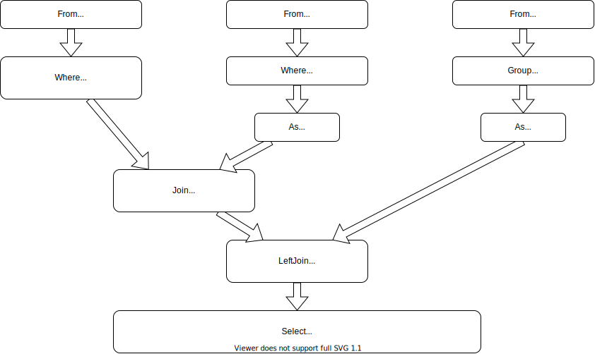

# Tutorial


## SQL and FunSQL

SQL is a specialized language used for querying and manipulating data in
database management systems.

FunSQL is a Julia library for assembling SQL queries.  It exposes full
expressive power of SQL through a uniform compositional interface.


## Sample Database

Throughout this tutorial, we use a tiny SQLite database containing a 10 person
sample of simulated patient data extracted from the [CMS DE-SynPuf
dataset](https://www.cms.gov/Research-Statistics-Data-and-Systems/Downloadable-Public-Use-Files/SynPUFs/DE_Syn_PUF).

If you want to follow along with the tutorial, you can download the database
file using the following code.

```julia
const URL = "https://github.com/MechanicalRabbit/ohdsi-synpuf-demo/releases/download/20210412/synpuf-10p.sqlite"
const DB = download(URL)
```

Alternatively, to avoid downloading the file more than once, we can register
the download URL as an [artifact](../Artifacts.toml).

    using Pkg.Artifacts, LazyArtifacts

    const DB = joinpath(artifact"synpuf-10p", "synpuf-10p.sqlite")

To interact with a SQLite database, we need to install the
[SQLite](https://github.com/JuliaDatabases/SQLite.jl) package.  Once the
package is installed, we can connect to the database.

    using SQLite

    const conn = SQLite.DB(DB)


## Database Schema

The data in the sample database is stored in the format of the [OMOP Common
Data Model](https://ohdsi.github.io/TheBookOfOhdsi/CommonDataModel.html), an
open source database schema for observational healthcare data.  In this
tutorial, we will only use a small fragment of the Common Data Model.


Before we can start assembling queries with FunSQL, we need to make FunSQL
aware of the database schema.  Specifically, for each table in the database, we
need to create a corresponding `SQLTable` object, which encapsulates the table
name and its columns.

    using FunSQL: SQLTable

The patient data, including basic demographic information, is stored in
the table `person`.

    const person =
        SQLTable(:person,
                 columns = [:person_id, :year_of_birth, :location_id])

Patient addresses are stored in a separate table `location`, linked to the
`person` table by the key `location_id`.

    const location =
        SQLTable(:location,
                 columns = [:location_id, :city, :state])

The bulk of patient data consists of clinical events: visits to healthcare
providers, recorded observations, diagnosed conditions, prescribed medications,
etc.  In this tutorial we only use two types of events: visits and conditions.

    const visit_occurrence =
        SQLTable(:visit_occurrence,
                 columns = [:visit_occurrence_id, :person_id,
                            :visit_concept_id,
                            :visit_start_date, :visit_end_date])

    const condition_occurrence =
        SQLTable(:condition_occurrence,
                 columns = [:condition_occurrence_id, :person_id,
                            :condition_concept_id,
                            :condition_start_date, :condition_end_date])

The specific type of the event (e.g., *Inpatient* visit or *Essential
hypertension* condition) is indicated using a *concept id* column, which
links to the `concept` table.

    const concept =
        SQLTable(:concept,
                 columns = [:concept_id, :concept_name])

Different concepts may be related to each other.  For instance, *Essential
hypertension* **is a** *Hypertensive disorder*, which itself **is a** *Disorder
of cardiovascular system*.  Concept relationships are recorded in the
corresponding table.

    const concept_relationship =
        SQLTable(:concept_relationship,
                 columns = [:concept_id_1, :concept_id_2, :relationship_id])


## First Query

Consider the following question:

*When was the last time each person born between 1930 and 1940 and living in
Illinois was seen by a healthcare provider?*

To answer this question, we build the following pipeline of data processing
SQL operations.



This pipeline can be assembled with FunSQL.  The nodes are created using the
corresponding *query constructors*, which are connected together using the pipe
(`|>`) operator.

    using FunSQL: Agg, Join, From, Fun, Get, Group, Select, Where

    q = From(person) |>
        Where(Fun.and(Get.year_of_birth .>= 1930,
                      Get.year_of_birth .<= 1940)) |>
        Join(:location => From(location) |>
                          Where(Get.state .== "IL"),
             on = Get.location_id .== Get.location.location_id) |>
        Join(:visit_group => From(visit_occurrence) |>
                             Group(Get.person_id),
             on = Get.person_id .== Get.visit_group.person_id,
             left = true) |>
        Select(Get.person_id,
               :max_visit_start_date =>
                   Get.visit_group |> Agg.max(Get.visit_start_date))

The following query constructors are available in FunSQL.

| Constructor        | Operation                                        |
| :----------------- | :----------------------------------------------- |
| `Append`           | concatenate datasets                             |
| `As` (`=>`)        | assign an alias                                  |
| `From`             | retrieve the content of a database table         |
| `Group`            | partition the dataset into disjoint groups       |
| `Join`, `LeftJoin` | correlate two datasets by a particular condition |
| `Select`           | specify the output columns                       |
| `Where`            | filter the dataset by a particular condition     |

Many of these constructors take scalar expressions as arguments.  For instance,
`Where` expects a predicate expression, e.g.,

    Where(Fun.and(Get.year_of_birth .>= 1930,
                  Get.year_of_birth .<= 1940))

Here, `Get.year_of_birth` refers to the column `year_of_birth` of the input
dataset.  To make this reference valid, `Where` must be chained to a query
whose output contains this column, such as `From(person)`.

An expression containing a SQL function or a SQL operator is created by taking
an appropriate attribute of a namespace object `Fun`.  Certain SQL functions
and operators, notably, comparison operators, could be created using the Julia
broadcasting notation.

Aggregate functions have their own namespace object `Agg`, e.g.,

    Agg.max(Get.visit_start_date)

In FunSQL, aggregate functions can be used in any context where an ordinary SQL
expression is permitted as long as the input dataset is partitioned using
`Group` or `Partition`.

Once the query pipeline is constructed, it could be serialized to a SQL query.
We can specify the target SQL dialect, such as `:sqlite` or `:postgresql`.

    using FunSQL: render

    sql = render(q, dialect = :sqlite)

    print(sql)
    #=>
    SELECT "person_3"."person_id", "visit_group_1"."max" AS "max_visit_start_date"
    FROM (
      SELECT "person_1"."location_id", "person_1"."person_id"
      FROM "person" AS "person_1"
      WHERE (("person_1"."year_of_birth" >= 1930) AND ("person_1"."year_of_birth" <= 1940))
    ) AS "person_3"
    JOIN (
      SELECT "location_1"."location_id"
      FROM "location" AS "location_1"
      WHERE ("location_1"."state" = 'IL')
    ) AS "location_3" ON ("person_3"."location_id" = "location_3"."location_id")
    LEFT JOIN (
      SELECT "visit_occurrence_1"."person_id", MAX("visit_occurrence_1"."visit_start_date") AS "max"
      FROM "visit_occurrence" AS "visit_occurrence_1"
      GROUP BY "visit_occurrence_1"."person_id"
    ) AS "visit_group_1" ON ("person_3"."person_id" = "visit_group_1"."person_id")
    =#

At this point, the job of FunSQL is done.  To submit the SQL query to the
database engine, we use an appropriate Julia library.

    res = DBInterface.execute(conn, sql)

In this tutorial, we use
[`DataFrame`](https://github.com/JuliaData/DataFrames.jl) interface to display
the output of the query.

    using DataFrames

    res |> DataFrame |> display
    #=>
    1×2 DataFrame
     Row │ person_id  max_visit_start_date
         │ Int64      String
    ─────┼─────────────────────────────────
       1 │     72120  2008-12-15
    =#

For the rest of this tutorial, we will use a convenience function that renders
the query object, executes the SQL query and returns its output.

    function run(q)
        sql = render(q, dialect = :sqlite)
        res = DBInterface.execute(conn, sql)
        DataFrame(res)
    end

    q |> run
    #=>
    1×2 DataFrame
     Row │ person_id  max_visit_start_date
         │ Int64      String
    ─────┼─────────────────────────────────
       1 │     72120  2008-12-15
    =#

