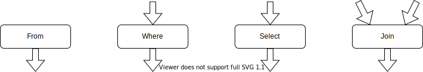

# Tutorial


## SQL and FunSQL

SQL is a specialized language used for querying and manipulating data in
database management systems.

FunSQL is a Julia library for assembling SQL queries.  It exposes full
expressive power of SQL through a uniform compositional interface.


## Sample Database

Throughout this tutorial, we use a tiny SQLite database containing a 10 person
sample of simulated patient data, which is extracted from the [CMS DE-SynPuf
dataset](https://www.cms.gov/Research-Statistics-Data-and-Systems/Downloadable-Public-Use-Files/SynPUFs/DE_Syn_PUF).

To follow along with the tutorial, you can download the database file using the
following code:

```julia
const URL = "https://github.com/MechanicalRabbit/ohdsi-synpuf-demo/releases/download/20210412/synpuf-10p.sqlite"
const DB = download(URL)
```

Alternatively, to avoid downloading the file more than once, we can register
the download URL as an [artifact](../Artifacts.toml) and use
[`Pkg.Artifacts`](http://pkgdocs.julialang.org/v1/artifacts/) API to fetch it:

    using Pkg.Artifacts, LazyArtifacts

    const DB = joinpath(artifact"synpuf-10p", "synpuf-10p.sqlite")

To interact with a SQLite database, we need to install the
[SQLite](https://github.com/JuliaDatabases/SQLite.jl) package.  Once the
package is installed, we can use it to connect to the database:

    using SQLite

    const conn = SQLite.DB(DB)


## Database Schema

The data in the sample database is stored in the format of the [OMOP Common
Data Model](https://ohdsi.github.io/TheBookOfOhdsi/CommonDataModel.html), an
open source database schema for observational healthcare data.  In this
tutorial, we will only use a small fragment of the Common Data Model.


Before we can start assembling queries with FunSQL, we need to make FunSQL
aware of the database schema.  Specifically, for each table in the database, we
need to create a corresponding `SQLTable` object, which encapsulates the table
name and its columns.

    using FunSQL: SQLTable

The patient data, including basic demographic information, is stored in
the table `person`:

    const person =
        SQLTable(:person,
                 columns = [:person_id, :year_of_birth, :location_id])

Patient addresses are stored in a separate table `location`, linked to the
`person` table by the key `location_id`:

    const location =
        SQLTable(:location,
                 columns = [:location_id, :city, :state])

The bulk of patient data consists of clinical events: visits to healthcare
providers, recorded observations, diagnosed conditions, prescribed medications,
etc.  In this tutorial we only use two types of events, visits and conditions:

    const visit_occurrence =
        SQLTable(:visit_occurrence,
                 columns = [:visit_occurrence_id, :person_id,
                            :visit_concept_id,
                            :visit_start_date, :visit_end_date])

    const condition_occurrence =
        SQLTable(:condition_occurrence,
                 columns = [:condition_occurrence_id, :person_id,
                            :condition_concept_id,
                            :condition_start_date, :condition_end_date])

The specific type of the event (e.g., *Inpatient* visit or *Essential
hypertension* condition) is indicated using a *concept id* column, which
refers to the `concept` table:

    const concept =
        SQLTable(:concept,
                 columns = [:concept_id, :concept_name])

Different concepts may be related to each other.  For instance, *Essential
hypertension* **is a** *Hypertensive disorder*, which itself **is a** *Disorder
of cardiovascular system*.  Concept relationships are recorded in the
corresponding table:

    const concept_relationship =
        SQLTable(:concept_relationship,
                 columns = [:concept_id_1, :concept_id_2, :relationship_id])


## Using FunSQL

In FunSQL, a SQL query is represented as a data processing pipeline assembled
from elementary data processing operations, each of which represents a
particular SQL clause.  Depending on its type, the operation may expect zero,
one or more input datasets, and it always emits one output dataset.  Visually,
we can represent a SQL operation as a pipeline node with a certain number of
input arrows and one output arrow.



To demonstrate query construction with FunSQL, let us consider the following
question:

*Who are the patients born between 1930 and 1940 and what is their current
age (by the end of 2020)?*

To answer this question, we assemble a simple SQL pipeline.


In FunSQL notation, pipeline nodes are created using appropriate `SQLNode`
constructors, such as `From`, `Where`, and `Select`, which are connected
together using the pipe (`|>`) operator:

    using FunSQL: From, Fun, Get, Select, Where

    q = From(person) |>
        Where(Fun.and(Get.year_of_birth .>= 1930,
                      Get.year_of_birth .< 1940)) |>
        Select(Get.person_id,
               :age => 2020 .- Get.year_of_birth)

Some of the `SQLNode` constructors take scalar expressions as arguments.  For
example, `Where` expects a predicate expression:

    Where(Fun.and(Get.year_of_birth .>= 1930,
                  Get.year_of_birth .< 1940))

The argument of this `Where` node is assembled using `Get` references, `Fun`
invocations, and broadcasted operators.  The expression `Get.year_of_birth`
refers to the column `year_of_birth` of the input dataset.  The SQL operator
`AND` is represented by a function `Fun.and`.  Any SQL function or operator can
be represented in this manner.  Certain functions and operators, notably,
comparison operators, could also be expressed using Julia broadcasting
notation.

Once the query pipeline is constructed, it could be serialized to a SQL query.
We can specify the target SQL dialect, such as `:sqlite` or `:postgresql`:

    using FunSQL: render

    sql = render(q, dialect = :sqlite)

    print(sql)
    #=>
    SELECT "person_1"."person_id", (2020 - "person_1"."year_of_birth") AS "age"
    FROM "person" AS "person_1"
    WHERE (("person_1"."year_of_birth" >= 1930) AND ("person_1"."year_of_birth" < 1940))
    =#

At this point, the job of FunSQL is done.  To submit the SQL query to the
database engine, we can use suitable Julia database bindings:

    res = DBInterface.execute(conn, sql)
    #-> SQLite.Query( … )

The output of the query could be displayed in a tabular form by converting it
to a [`DataFrame`](https://github.com/JuliaData/DataFrames.jl) object:

    using DataFrames

    res |> DataFrame |> display
    #=>
    2×2 DataFrame
     Row │ person_id  age
         │ Int64      Int64
    ─────┼──────────────────
       1 │     30091     88
       2 │     72120     83
    =#


