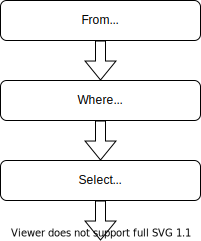

# Tutorial


## SQL and FunSQL

SQL is a specialized language used for querying and manipulating data in
database management systems.

FunSQL is a Julia library for assembling SQL queries.  It exposes full
expressive power of SQL through a uniform compositional interface.


## Sample Database

Throughout this tutorial, we use a tiny SQLite database containing a 10 person
sample of simulated patient data, which is extracted from the [CMS DE-SynPuf
dataset](https://www.cms.gov/Research-Statistics-Data-and-Systems/Downloadable-Public-Use-Files/SynPUFs/DE_Syn_PUF).

To follow along with the tutorial, you can download the database file using the
following code:

```julia
const URL = "https://github.com/MechanicalRabbit/ohdsi-synpuf-demo/releases/download/20210412/synpuf-10p.sqlite"
const DB = download(URL)
```

Alternatively, to avoid downloading the file more than once, we can register
the download URL as an [artifact](../Artifacts.toml) and use
[`Pkg.Artifacts`](http://pkgdocs.julialang.org/v1/artifacts/) API to fetch it:

    using Pkg.Artifacts, LazyArtifacts

    const DB = joinpath(artifact"synpuf-10p", "synpuf-10p.sqlite")

To interact with a SQLite database, we need to install the
[SQLite](https://github.com/JuliaDatabases/SQLite.jl) package.  Once the
package is installed, we can use it to connect to the database:

    using SQLite

    const conn = SQLite.DB(DB)


## Database Schema

The data in the sample database is stored in the format of the [OMOP Common
Data Model](https://ohdsi.github.io/TheBookOfOhdsi/CommonDataModel.html), an
open source database schema for observational healthcare data.  In this
tutorial, we will only use a small fragment of the Common Data Model.


Before we can start assembling queries with FunSQL, we need to make FunSQL
aware of the database schema.  Specifically, for each table in the database, we
need to create a corresponding `SQLTable` object, which encapsulates the table
name and its columns.

    using FunSQL: SQLTable

The patient data, including basic demographic information, is stored in
the table `person`:

    const person =
        SQLTable(:person,
                 columns = [:person_id, :year_of_birth, :location_id])

Patient addresses are stored in a separate table `location`, linked to the
`person` table by the key `location_id`:

    const location =
        SQLTable(:location,
                 columns = [:location_id, :city, :state])

The bulk of patient data consists of clinical events: visits to healthcare
providers, recorded observations, diagnosed conditions, prescribed medications,
etc.  In this tutorial we only use two types of events, visits and conditions:

    const visit_occurrence =
        SQLTable(:visit_occurrence,
                 columns = [:visit_occurrence_id, :person_id,
                            :visit_concept_id,
                            :visit_start_date, :visit_end_date])

    const condition_occurrence =
        SQLTable(:condition_occurrence,
                 columns = [:condition_occurrence_id, :person_id,
                            :condition_concept_id,
                            :condition_start_date, :condition_end_date])

The specific type of the event (e.g., *Inpatient* visit or *Essential
hypertension* condition) is indicated using a *concept id* column, which
refers to the `concept` table:

    const concept =
        SQLTable(:concept,
                 columns = [:concept_id, :concept_name])

Different concepts may be related to each other.  For instance, *Essential
hypertension* **is a** *Hypertensive disorder*, which itself **is a** *Disorder
of cardiovascular system*.  Concept relationships are recorded in the
corresponding table:

    const concept_relationship =
        SQLTable(:concept_relationship,
                 columns = [:concept_id_1, :concept_id_2, :relationship_id])


## Using FunSQL

In FunSQL, a database query is represented as a data processing pipeline
assembled from elementary data processing operations, each of which represents
a particular SQL clause.  Depending on its type, the operation may expect zero,
one or more input datasets, and it always emits one output dataset.  Visually,
we can represent a SQL operation as a pipeline node with a certain number of
input arrows and one output arrow.


To demonstrate query construction with FunSQL, let us consider the following
question:

*Who are the patients born between 1930 and 1940 and what is their current
age (by the end of 2020)?*

To answer this question, we assemble a simple SQL pipeline.


In FunSQL notation, pipeline nodes are created using appropriate query
constructors, such as `From`, `Where`, and `Select`, which are connected
together using the pipe (`|>`) operator:

    using FunSQL: From, Fun, Get, Select, Where

    q = From(person) |>
        Where(Fun.and(Get.year_of_birth .>= 1930,
                      Get.year_of_birth .< 1940)) |>
        Select(Get.person_id,
               :age => 2020 .- Get.year_of_birth)

Some of the query constructors take scalar expressions as arguments.  For
example, `Where` expects a predicate expression:

    Where(Fun.and(Get.year_of_birth .>= 1930,
                  Get.year_of_birth .< 1940))

The argument of this `Where` node is assembled using `Get` references, `Fun`
invocations, and broadcasted operators.  The expression `Get.year_of_birth`
refers to the column `year_of_birth` of the input dataset.  The SQL operator
`AND` is represented by a function `Fun.and`.  Any SQL function or operator can
be represented in this manner.  Certain functions and operators, notably,
comparison operators, could also be expressed using Julia broadcasting
notation.

Once the query pipeline is constructed, it could be serialized to a SQL query.
We can specify the target SQL dialect, such as `:sqlite` or `:postgresql`:

    using FunSQL: render

    sql = render(q, dialect = :sqlite)

    print(sql)
    #=>
    SELECT "person_1"."person_id", (2020 - "person_1"."year_of_birth") AS "age"
    FROM "person" AS "person_1"
    WHERE (("person_1"."year_of_birth" >= 1930) AND ("person_1"."year_of_birth" < 1940))
    =#

At this point, the job of FunSQL is done.  To submit the SQL query to the
database engine, we can use suitable Julia database bindings:

    res = DBInterface.execute(conn, sql)
    #-> SQLite.Query( … )

The output of the query could be displayed in a tabular form by converting it
to a [`DataFrame`](https://github.com/JuliaData/DataFrames.jl) object:

    using DataFrames

    res |> DataFrame |> display
    #=>
    2×2 DataFrame
     Row │ person_id  age
         │ Int64      Int64
    ─────┼──────────────────
       1 │     30091     88
       2 │     72120     83
    =#


## Assembling Queries

FunSQL represents SQL queries and their components as objects of type
`SQLNode`.  FunSQL provides a large collection of `SQLNode` constructors such
as `From`, `Where`, `Select`, `Get`, and `Fun`.  Many of these constructors
expect other `SQLNode` objects as arguments so that together they assemble into
a directed acyclic graph.

FunSQL recognizes two kinds of SQL expressions: *tabular* operations and *row*
operations.  Tabular operations take a certain number of input datasets and
produce an output dataset.  Row operations act on a dataset row and produce a
scalar value.

The majority of tabular operations are parameterized with row expressions.
Likewise, a row operation may include a tabular expression, which in this case
is called a (correlated) subquery.

The following tabular operations are available in FunSQL.

| Constructor           | Function                                          |
| :-------------------- | :------------------------------------------------ |
| `Append`              | concatenate datasets                              |
| `As`, `=>`            | introduce a namespace                             |
| `Bind`                | correlate a subquery in a *join* expression       |
| `Define`              | add an output column                              |
| `From`                | produce the content of a database table           |
| `Group`               | partition the dataset into disjoint groups        |
| `Join`, `LeftJoin`    | correlate two datasets                            |
| `Limit`               | truncate the dataset                              |
| `Order`               | sort the dataset                                  |
| `Partition`           | add a window to the dataset                       |
| `Select`              | specify output columns                            |
| `Where`               | filter the dataset by the given condition         |

The following row operations are available in FunSQL.

| Constructor           | Function                                          |
| :-------------------- | :------------------------------------------------ |
| `Agg`                 | invoke an aggregate function                      |
| `As`, `=>`            | assign a column alias                             |
| `Bind`                | correlate a subquery                              |
| `Fun`, *broadcasting* | invoke a scalar function                          |
| `Get`                 | produce the value of a column                     |
| `Lit`                 | produce a constant value                          |
| `Sort`, `Asc`, `Desc` | indicate the sort order                           |
| `Var`                 | produce the value of a query parameter            |

Note that some `SQLNode` constructors (`As`, `Bind`) can be used both as a
tabular operation and as a row operation.


## `From`, `Where`, and `Select`

Recall the query demonstrated in the [Using FunSQL](@ref) section:

    From(person) |>
    Where(Fun.and(Get.year_of_birth .>= 1930,
                  Get.year_of_birth .< 1940)) |>
    Select(Get.person_id,
           :age => 2020 .- Get.year_of_birth)

This query is constructed from the tabular operations `From`, `Where`,
and `Select` arranged in a typical three-component pipeline.



The `From` operation takes no inputs and produces the content of a database
table.  The `From` constructor takes a `SQLTable` object describing the table.
In a query expression, a `SQLTable` object is implicitly converted to to a
`From` operation; thus the query above could be written as:

    person |>
    Where(Fun.and(Get.year_of_birth .>= 1930,
                  Get.year_of_birth .< 1940)) |>
    Select(Get.person_id,
           :age => 2020 .- Get.year_of_birth)

The `Select` operation allows us to specify the output columns.  The name of
the column is specified using the pair (`=>`) operator, which is in fact
a shorthand for the `As` operation, so that we can equivalently write:

    using FunSQL: As

    Select(Get.person_id,
           2020 .- Get.year_of_birth |> As(:age))

If the column name is not given explicitly, it is derived from the expression
that calculates the column value: the name of the reference if the expression
is a column reference or the name of the function of the top-level expression
is an invocation of a SQL function or an operator.

We should note that as opposed to SQL, FunSQL does not require that the query
has an explicit `Select` constructor, so that the following expression is a
valid and complete query:

    q = From(person)

This SQL query produces all the columns from the `person` table:

    sql = render(q)

    print(sql)
    #=>
    SELECT "person_1"."person_id", "person_1"."year_of_birth", "person_1"."location_id"
    FROM "person" AS "person_1"
    =#

It is also possible to construct a query without `From`.  When a tabular
operation, such as `Select`, that expects an input dataset isn't provided with
one explicitly, it is supplied with the *unit* dataset consisting of one row
and no columns.  This allows us to create queries that do not depend on the
content of any database tables.

    q = Select(Fun.current_timestamp())

    sql = render(q)

    print(sql)
    #-> SELECT CURRENT_TIMESTAMP AS "current_timestamp"


## Column References: `Get`

As we assemble row operations, we often need to reference a column of the input
dataset.  FunSQL provides two ways to do it: bound references and unbound
references.

An unbound reference is created using the `Get` constructor:

    Get(:person_id)

A convenient shorthand notation is available:

    Get.person_id

A string value could be used instead of a symbol, which is useful when the name
of the column is not a valid Julia identifier:

    Get("person_id")
    Get."person_id"

An unbound column reference is always resolved at the place of use.  The
reference to the `year_of_birth` column appears several times in the following
query:

    From(person) |>
    Where(Fun.and(Get.year_of_birth .>= 1930,
                  Get.year_of_birth .< 1940)) |>
    Select(Get.person_id,
           :age => 2020 .- Get.year_of_birth)

As a part of `Where`, it refers to the column produced by the `From` operation,
but inside `Select`, it refers to the output of `Where`.

It is also possible to bind column references to particular nodes.  The
query above could be written as follows:

    q1 = From(person)
    q2 = q1 |>
         Where(Fun.and(q1.year_of_birth .>= 1930,
                       q1.year_of_birth .< 1940))
    q3 = q2 |>
         Select(q1.person_id,
                :age => 2020 .- q1.year_of_birth)

We replaced unbound references `Get.year_of_birth` and `Get.person_id` with
*bound* references: `q1.year_of_birth` and `q1.person_id`.  If we use a
bound reference, the node to which the reference is bound must be a part
of the query; otherwise, an error will be raised.  Note that in the `Select`
constructor, we could also replace references to `q1` with `q2`, it will
not change the meaning of the query:

    q3 = q2 |>
         Select(q2.person_id,
                :age => 2020 .- q2.year_of_birth)

Use of unbound references makes query composition more modular.  For example,
we could encapsulate the condition on the birth range in a Julia function and
use it as follows:

    BirthRange(start, stop) =
        Fun.and(Get.year_of_birth .>= start,
                Get.year_of_birth .< stop)

    From(person) |> Where(BirthRange(1930, 1940))

On the other hand, bound references make it easy to disambiguate columns
of different tables.

## Literal Values: `Lit`

## SQL Functions and Operators: `Fun` and Broadcasting

## Correlating Data with `Join`

