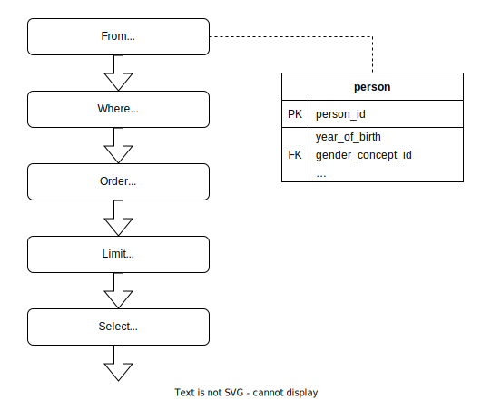

# Two Kinds of SQL Query Builders

```@meta
CurrentModule = FunSQL
```

The SQL language has a paradoxical fate.  Although it was deliberately designed
to appeal to a human user, nowadays most of SQL code is written—or rather
generated—by the computer.  Many computer programs need to query some database,
and, for the vast majority of database servers, the only supported query
language is SQL.  But generating SQL is difficult because of the complicated
and obscure rules of its quasi-English grammar (its original name SEQUEL stands
for Structured *English* Query Language).  For this reason, programs that
interact with a database often use specialized libraries for generating SQL
queries.

One of such libraries is FunSQL.  FunSQL is designed with two goals in mind:
supporting the full range of SQL's querying capabilities and exposing these
capabilities in a compositional, data-oriented interface.  This makes FunSQL
the best tool for data analysis in SQL and differentiates it from all the other
query building libraries.

And yet the difference between FunSQL and other query builders is not
immediately apparent.  In fact, the interfaces of various query building
libraries seem almost identical.  A query that finds *100 oldest male patients*
(in the [OMOP CDM](https://ohdsi.github.io/CommonDataModel/cdm53.html)
database) is assembled with FunSQL as follows:
```julia
From(:person) |>
Where(Get.gender_concept_id .== 8507) |>
Order(Get.year_of_birth) |>
Limit(100) |>
Select(Get.person_id)
```
The same query can be written in Ruby using [Active Record Query
Interface](https://guides.rubyonrails.org/active_record_querying.html):
```ruby
Person
.where("gender_concept_id = ?", 8507)
.order(:year_of_birth)
.limit(100)
.select(:person_id)
```
Or in PHP with [Laravel's Query Builder](https://laravel.com/docs/9.x/queries):
```php
DB::table('person')
->where('gender_concept_id', '=', 8507)
->orderBy('year_of_birth')
->limit(100)
->select('person_id')
```
In C#'s [EF/LINQ](https://docs.microsoft.com/en-us/ef/core/querying/):
```csharp
Person
.Where(p => p.gender_concept_id == 8507)
.OrderBy(p => p.year_of_birth)
.Take(100)
.Select(p => new { person_id = p.person_id });
```
Or in R with [dbplyr](https://dbplyr.tidyverse.org/):
```r
tbl(conn, "person") %>%
filter(gender_concept_id == 8507) %>%
arrange(year_of_birth) %>%
head(100) %>%
select(person_id)
```
In each of these code samples, the query is assembled using essentially the
same interface.  Stripped of its syntactic shell, the process of assembling the
query can be visualized as a diagram of five processing nodes connected in a
pipeline:



It is precisely the fact that the query is progressively assembled using
atomic, independent components that lets us call this interface
*compositional*.

However we did claim that FunSQL differs from all the other query building
libraries, and now apparently proved the opposite?  As a matter of fact, there
is a difference, even if it is not reflected in notation.  To demonstrate this,
let us rearrange this pipeline, moving the `Order` and the `Limit` nodes in
front of `Where`.


How does this rearrangement affect the output of the query?  Perhaps
unexpectedly, the answer depends on the library.  With FunSQL, as well as
EF/LINQ and dbplyr, it changes the output from *100 oldest male patients* to
*the males among 100 oldest patients*.  But not so with the other two
libraries, Active Record and Laravel, where rearranging the pipeline has *no*
effect on the output.

To summarize, the following query builders are sensitive to the order of the
pipeline nodes:

- FunSQL
- EF/LINQ
- dbplyr

And the following are not:

- Active Record
- Laravel

These are the two kinds of query builders from this article's title.  But how
can these libraries act so differently while sharing the same interface?  To
answer this question, we need to focus on what is only implicitly present on
the pipeline diagram: the information that is processed by the pipeline nodes.


A node with one incoming and one outgoing arrow symbolizes a processing unit
that takes the input data, transforms it, and emits the output data.  While the
character of the data is not revealed, it is tempting to assume it to be the
tabular data extracted from the database.


But this can't be right, at least not literally, because a SQL query builder
cannot read the data in the database.  Instead, the query builder generates a
SQL query:
```sql
SELECT "person_1"."person_id"
FROM "person" AS "person_1"
WHERE ("person_1"."gender_concept_id" = 8507)
ORDER BY "person_1"."year_of_birth"
LIMIT 100
```
But if we assume for a moment that pipeline nodes could process the data
directly, we would expect that both the pipeline and the corresponding SQL
query produce the same output.  In other words, the role of the pipeline is to
specify the expected output of the SQL query.  This is how pipeline nodes are
interpreted by FunSQL and the other two libraries, EF/LINQ and dbplyr.  We can
call such query builders *data-oriented*.

The conversion of the pipeline to SQL is not always that straightforward.  Even
though we could freely reorder the nodes in a pipeline, we cannot do the same
to the clauses in a SQL query.  This is because the SQL grammar arranges the
clauses in a rigid order:

1) `FROM`, followed by zero, one or more
2) `JOIN`, followed by
3) `WHERE`, followed by
4) `GROUP BY`, followed by
5) `HAVING`, followed by
6) `ORDER BY`, followed by
7) `LIMIT`, followed by
8) `SELECT`, written at the top of the query, but the last one to perform.

This order is compatible with the first pipeline, where the `Where` node is
followed by `Order` and `Limit`, but not the second pipeline, where these nodes
change their relative positions.  So how could the second pipeline be converted
to SQL?  We would be out of options if we were still using the original SQL
standard, SQL-86, but the next revision of the language, SQL-92, recognized
this limitation.  Regrettably, it did not relax this rigid clause order.
Instead, SQL-92 introduced a workaround: a query can be extended by nesting it
into the next query's `FROM` clause.  This gives us a method for converting an
arbitrary pipeline into SQL: break the pipeline into smaller chunks that comply
with the SQL clause order, convert each chunk into a SQL query, and then nest
all these queries together:
```sql
SELECT "person_2"."person_id"
FROM (
  SELECT
    "person_1"."person_id",
    "person_1"."gender_concept_id"
  FROM "person" AS "person_1"
  ORDER BY "person_1"."year_of_birth"
  LIMIT 100
) AS "person_2"
WHERE ("person_2"."gender_concept_id" = 8507)
```

The SQL grammar has a number of deficiencies, including rigid clause order,
query nesting, and nonsensical position of the `SELECT` clause.  The position
of `SELECT` violates the logical flow of the query, and this violation is
aggravated by query nesting.  Complex SQL queries often require multiple levels
of nesting, which makes such queries bloated and difficult to interpret.  This
is where data-oriented query builders, which do not constrain the order of
pipeline nodes, offer an improvement over plain SQL.

What about the other kind of query builders?  Active Record and Laravel employ
a pipeline of exactly the same form, but because it is not sensitive to the
order of the nodes, it must work on a different principle.  Indeed, this
pipeline generates a SQL query by incrementally assembling the SQL syntax tree.
Because of the rigid clause order, a SQL syntax tree can be faithfully
represented as a composite data structure with slots specifying the content of
the `SELECT`, `FROM`, `WHERE`, and the other clauses:
```julia
struct SQLQuery
    select
    from
    joins
    where
    groupby
    having
    orderby
    limit
end
```
Individual slots of this structure are populated by the corresponding pipeline
nodes.


This explains why the pipeline is insensitive to the order of the nodes.
Indeed, as long as the content of the slots stays the same, it makes no
difference in what order the slots are populated.


This method of incrementally constructing a composite structure is known as the
[*builder pattern*](https://en.wikipedia.org/wiki/Builder_pattern).  We can
call the query builders that employ this pattern *syntax-oriented*.

Both data-oriented and syntax-oriented query builders are compositional: the
difference is in the nature of the information processed by the units of
composition.  Data-oriented query builders incrementally refine the query
output; syntax-oriented query builders incrementally assemble the SQL syntax
tree.  Their interfaces look almost identical, but their methods of operation
are fundamentally different.

But which one is better?  Syntax-oriented query builders have two definite
advantages: they are easy to implement and they could support the full range of
SQL features.  Indeed, the interface of a syntax-oriented query builder is just
a collection of builders for the SQL syntax tree.  How complete the
representation of the syntax tree determines how well various SQL features are
supported.

On the other hand, syntax-oriented query builders are harder to *use*.  As they
directly represent the SQL grammar, they inherit all of its deficiencies.  In
particular, the rigid clause order makes it difficult to assemble complex data
processing pipelines, especially when the arrangement of pipeline nodes is not
predetermined.

A data-oriented query builder directly represents data processing nodes, which
makes assembling data processing pipelines much more straightforward—as long as
we can find the necessary nodes among those offered by the builder.  But where
does the builder get its collection of data processing nodes?  And how can we
tell if this collection is complete?

For implementing a data-oriented query builder, a natural starting point is a
general-purpose query framework.  Indeed, this is the origin of EF/LINQ, which
is derived from
[LINQ](https://docs.microsoft.com/en-us/dotnet/standard/using-linq), and
dbplyr, which is derived from [dplyr](https://dplyr.tidyverse.org/).  The query
framework determines what processing nodes are available and how they operate.
In principle, any query framework could be adapted to SQL databases by
introducing just one node, a node that loads the content of a database table.
If we place this node at the beginning of a pipeline and use regular nodes to
make the rest of the pipeline, we get a pipeline that processes the data from
the database.  However, this pipeline will be very inefficient compared to a
SQL engine, which can use indexes to avoid loading the entire table into memory
and thus can process the same data much faster.  This is why EF/LINQ and dbplyr
generate a SQL query to replace this pipeline as a whole.  The pipeline itself
no longer runs directly, but now serves as a specification, with the assumption
that if it *were* to run, it would produce the same output as the SQL query.
This method of transforming a general-purpose query framework to a SQL query
builder is called *SQL pushdown*.

However, SQL pushdown has serious limitations.  A general-purpose query
framework is not designed with SQL compatibility in mind.  For this reason,
some pipelines assembled within this framework cannot be converted to SQL.
Even worse, many useful SQL queries have no equivalent pipelines and thus
cannot be generated using SQL pushdown.  SQL accumulated a wide range of
features and capabilities since it first appeared in 1974.  The first version
of the SQL standard, SQL-86, supported Cartesian products, filtering, grouping,
aggregation, and correlated subqueries.  The next version, SQL-92, added many
join types and introduced query nesting.  SQL:1999 added two new types of
queries: recursive queries, to enable bill-of-material calculations, and data
cube queries, which generalize histograms, cross-tabulations, roll-ups,
drill-downs, and sub-totals.  Further, SQL:2003 added support for aggregation
over a running window.  SQL is a quintessential *enterprise abomination*, a
hodgepodge of features added to support every imaginable use case, but with
inadequate syntax, weird gaps in functionality, and no regards to internal
consistency.  Nevertheless, the breadth of SQL's capabilities has not been
matched by any other query framework, including LINQ or dplyr.  So when we
generate SQL queries using EF/LINQ or dbplyr, a large subset of these
capabilities remains inaccessible.

FunSQL is a data-oriented query builder created specifically to expose full
expressive power of SQL.  Unlike EF/LINQ and dbplyr, FunSQL was not derived
from an existing query framework, but was carefully designed from scratch to
match SQL's capabilities.  These capabilities include, for example, support for
correlated subqueries and lateral joins (with [`Bind`](@ref) node), aggregate
and window functions (using [`Group`](@ref) and [`Partition`](@ref) nodes), as
well as recursive queries (with [`Iterate`](@ref) node).  This comprehensive
support for SQL capabilities makes FunSQL the only SQL query builder suitable
for assembling complex data processing pipelines.  Moreover, even though FunSQL
pipelines cannot be run directly, every FunSQL node has a well-defined data
processing semantics, which means that, in principle, FunSQL could be developed
into a complete query framework.  This potentially opens a path for replacing
SQL with an equally powerful, but a more coherent and expressive query
language.
